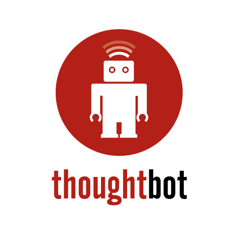

# Logo

Three directions for logos: horizontal, vertical, and circular. The circle logo lacks our name.

### Horizontal

* [Version for dark backgrounds](horizontal/png/for dark backgrounds.png)
* [Vector versions](horizontal/vector)

### Circular

* [Vector versions](circle/vector)

### Vertical

* [Version for dark backgrounds](vertical/png/for dark backgrounds.png)
* [Vector versions](horizontal/vector)

## Guidelines

* Don't use the robot outside of the circle
* Prefer the horizontal logo for all marketing uses
* Use the circle logo, without the company name, on internal branding, or only
  in close proximity with our name or other identifiable branding
* Avoid bisecting the circle of the logo, but if you need to, it's OK. It is
  best to do 3/4 of the logo visible, rather than to bisect the circle in half.
